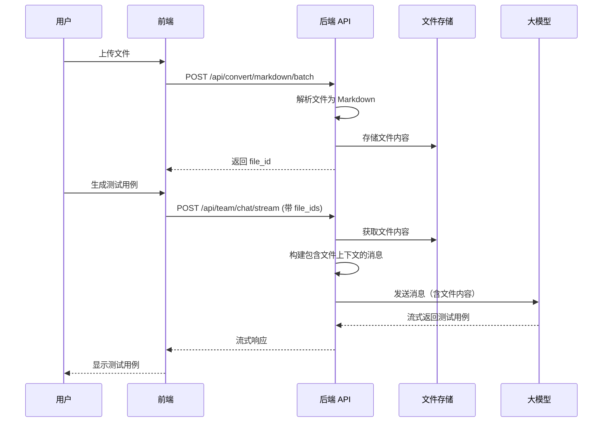

# 文件上下文功能快速指南

## 🎯 功能概述

允许用户上传文件（PDF、图片等），系统自动解析为 Markdown 格式，然后在生成测试用例时将文件内容作为上下文传递给大模型。

## 🚀 快速开始

### 1. 上传文件并解析

**API 端点**: `POST /api/convert/markdown/batch`

**请求示例**:
```bash
curl -X POST "http://localhost:8000/api/convert/markdown/batch" \
  -F "files=@需求文档.pdf" \
  -F "files=@设计文档.docx" \
  -F "use_llm=false"
```

**响应示例**:
```json
{
  "total": 2,
  "success_count": 2,
  "failed_count": 0,
  "results": [
    {
      "success": true,
      "file_id": "550e8400-e29b-41d4-a716-446655440000",
      "filename": "需求文档.pdf",
      "markdown": "# 登录功能需求\n\n用户可以通过用户名和密码登录...",
      "metadata": {
        "page_count": 5
      }
    },
    {
      "success": true,
      "file_id": "660e8400-e29b-41d4-a716-446655440001",
      "filename": "设计文档.docx",
      "markdown": "# 登录页面设计\n\n页面包含用户名输入框...",
      "metadata": {}
    }
  ]
}
```

**重要**: 保存返回的 `file_id`，后续生成测试用例时需要使用。

### 2. 使用文件上下文生成测试用例

**API 端点**: `POST /api/team/chat/stream`

**请求示例**:
```bash
curl -X POST "http://localhost:8000/api/team/chat/stream" \
  -H "Content-Type: application/json" \
  -d '{
    "message": "请根据需求文档和设计文档，生成登录功能的完整测试用例",
    "file_ids": [
      "550e8400-e29b-41d4-a716-446655440000",
      "660e8400-e29b-41d4-a716-446655440001"
    ]
  }'
```

**响应**: 流式返回测试用例生成过程

## 📋 支持的文件格式

- ✅ PDF (.pdf)
- ✅ 图片 (.png, .jpg, .jpeg, .webp)
- ✅ Word 文档 (.docx)
- ✅ PowerPoint (.pptx)
- ✅ Excel (.xlsx)

## 🔍 工作原理



## 💡 使用技巧

### 1. 单个文件
```json
{
  "message": "请根据需求文档生成测试用例",
  "file_ids": ["file_id_1"]
}
```

### 2. 多个文件
```json
{
  "message": "请根据需求文档和设计文档生成测试用例",
  "file_ids": ["file_id_1", "file_id_2", "file_id_3"]
}
```

### 3. 不使用文件
```json
{
  "message": "请生成一个简单的登录测试用例"
  // 不传 file_ids 或传 null
}
```

## 🐛 常见问题

### Q1: 文件上传成功，但生成测试用例时没有使用文件内容？

**检查步骤**:
1. 确认文件解析成功，`success: true`
2. 确认保存了正确的 `file_id`
3. 确认在生成测试用例时传递了 `file_ids` 参数
4. 查看后端日志，确认有以下输出：
   ```
   💾 存储文件: xxx.pdf (ID: xxx, Markdown长度: xxx 字符)
   📋 构建消息上下文，file_ids: ['xxx']
   📄 添加文件上下文: xxx.pdf (长度: xxx 字符)
   ✅ 成功构建包含 N 个文件的上下文消息
   ```

### Q2: 文件 ID 不存在？

**原因**: 
- 文件存储在内存中，服务重启后会丢失
- 文件 ID 输入错误

**解决方案**:
- 重新上传文件
- 检查 file_id 是否正确

### Q3: 支持多大的文件？

**限制**:
- 单个文件: 默认 50MB（可在 `config.py` 中配置）
- 批量上传: 默认最多 10 个文件（可配置）
- Markdown 内容: 建议不超过模型上下文窗口（如 128K tokens）

### Q4: 文件内容太长怎么办？

**建议**:
1. 使用 `page_range` 参数只解析部分页面
2. 将大文件拆分为多个小文件
3. 提取关键内容后手动输入

## 📊 调试日志

启用调试模式后，可以看到详细的日志：

```
💾 存储文件: 需求文档.pdf (ID: abc123, Markdown长度: 1234 字符)
📋 构建消息上下文，file_ids: ['abc123']
📄 添加文件上下文: 需求文档.pdf (长度: 1234 字符)
✅ 成功构建包含 1 个文件的上下文消息
```

如果出现问题，会看到警告：
```
⚠️ 文件 ID abc123 不存在于存储中
⚠️ 文件 xxx.pdf 没有 markdown 内容
⚠️ 没有找到任何文件上下文，file_ids: ['abc123']
```

## 🧪 测试

运行测试验证功能：

```bash
cd backend
source venv/bin/activate
python tests/test_file_context.py
```

运行示例：

```bash
cd backend
source venv/bin/activate
python examples/file_context_example.py
```

## 📚 相关文档

- [详细修复文档](file_context_fix.md)
- [API 文档](../backend/README.md)
- [测试用例团队使用指南](../README.md#测试用例智能体团队)

## 🔗 相关 API

| API | 说明 |
|-----|------|
| `POST /api/convert/markdown` | 单文件转换 |
| `POST /api/convert/markdown/batch` | 批量文件转换 |
| `POST /api/team/chat/stream` | 测试用例团队流式对话 |
| `POST /api/chat/stream` | 普通对话（也支持 file_ids） |

## ⚙️ 配置选项

在 `backend/config.py` 中可以配置：

```python
# Markdown 转换配置
markdown_use_llm: bool = False  # 是否使用 LLM 提升转换精度
markdown_force_ocr: bool = False  # 是否强制 OCR
markdown_disable_image_extraction: bool = False  # 是否禁用图片提取
markdown_max_file_size_mb: int = 50  # 单文件最大大小（MB）
markdown_max_batch_files: int = 10  # 批量上传最大文件数
```

## 🎉 总结

文件上下文功能让测试用例生成更加智能和准确：

1. ✅ 上传需求文档、设计文档等文件
2. ✅ 自动解析为 Markdown 格式
3. ✅ 生成测试用例时自动包含文件内容
4. ✅ 大模型基于实际需求生成测试用例

---

**最后更新**: 2025-10-11

